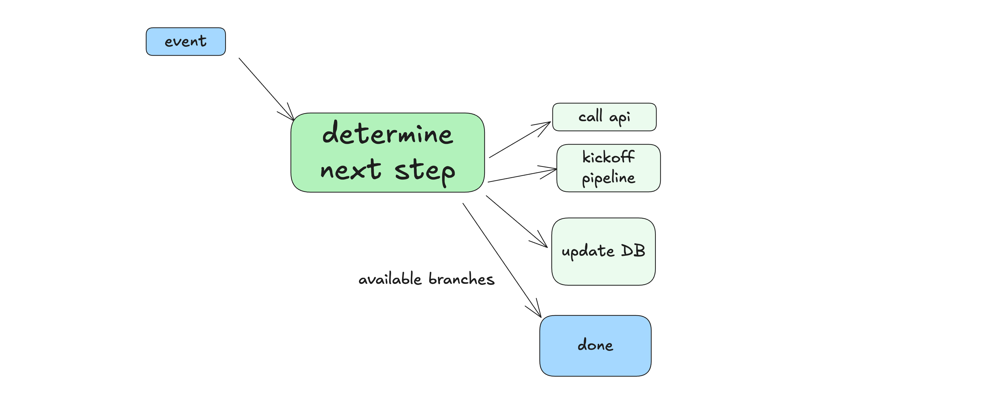
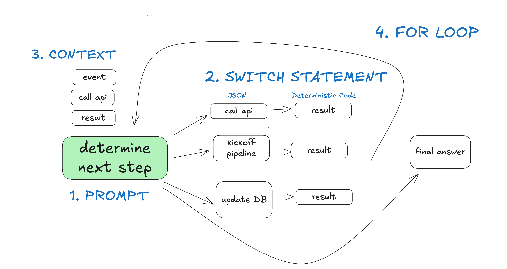
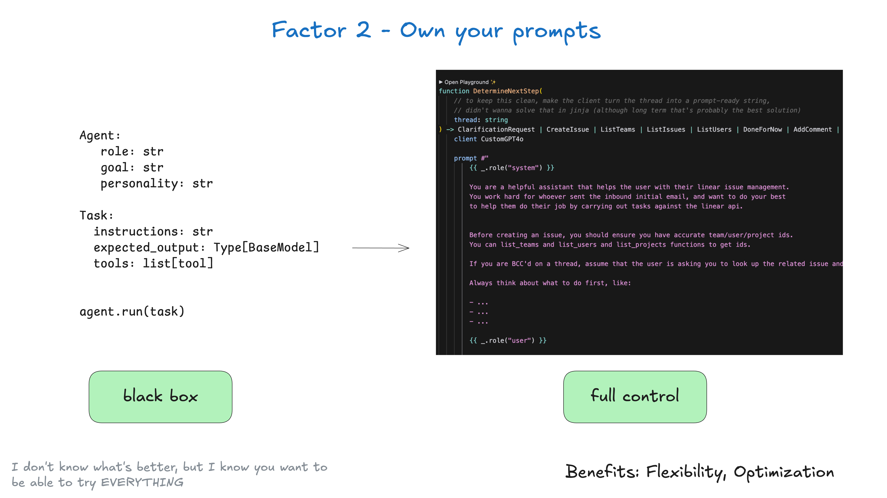
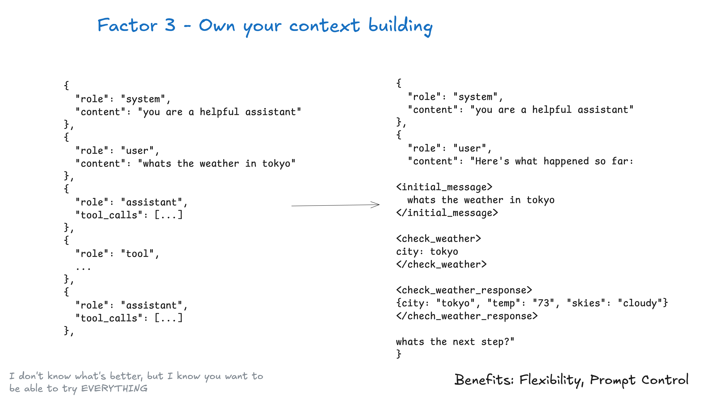
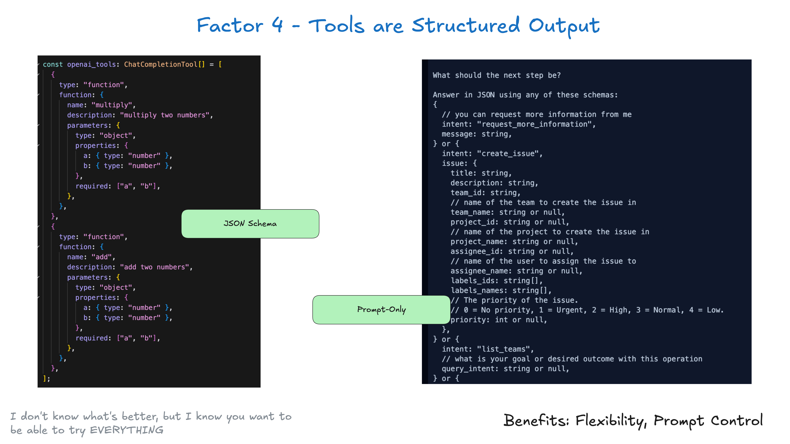

### DRAFT

Preview - this is a draft of everything I've learned in a year working with agents, and I imagine it may evolve a bit as we go.

The source is public at https://github.com/humanlayer/12-factor-agents, and I welcome your feedback and contributions. Let's figure this out together!


## 12 Factor Agents OR "Agents the Hard Way"

*An open letter to AI Agent builders and the makers of AI Agent tooling*

## you don't have to listen to me

Whether you're new to agents or an ornery old veteran like me, I'm going to try to convince you to throw out most of what you think about AI Agents, take a step back, and rethink them from first principles. (spoiler alert if you didn't catch the OpenAI responses launch a few weeks back, but pushing MORE agent logic behind an API ain't it)

### but first, some context

I've been hacking on agents for a while. 

**I've tried every agent framework out there**, from the plug-and-play crew/langchains to the "minimalist" smolagents of the world to the "production grade" langraph, griptape, etc. 

I've talked to a lot of really strong founders, in and out of YC, who are all building really impressive things with AI. Most of them are rolling the stack themselves. Almost none of them are using a "framework".

**I've been surprised to find** that most of the products out there billing themselves as "AI Agents" are not  all that agentic. A lot of them are mostly deterministic code, with LLM steps sprinkled in at just the right points to make the experience truly magical.

Agents, at least the good ones, don't follow the "here's your prompt, here's a bag of tools, loop until you hit the goal" pattern. Rather, they are comprised of mostly just software.


**So if this magical "here's your prompt, here's your tools, go figure it out"** workflow that we see everywhere isn't the answer, then what makes an agent an agent? That is,

> ### **What are the principles we can use to build LLM-powered software that is actually good enough to put in the hands of production customers?**

Welcome to 12-factor agents. As every Chicago mayor since Daley has consistently plastered all over the city's major airports, we're glad you're here.

## The Short Version: The 12 Factors

Jump to Part II: [12-Factor Agents](#12-factor-agents), or into any of the particular factors below.

- [Factor 1: Natural Language to Tool Calls](#1-natural-language-to-tool-calls)
- [Factor 2: Own your prompts](#2-own-your-prompts)
- [Factor 3: Own your context window](#3-own-your-context-window)
- [Factor 4: Tools are just structured outputs](#4-tools-are-just-structured-outputs)
- [Factor 5: Unify execution state and business state](#5-unify-execution-state-and-business-state)
- [Factor 6: Launch/Pause/Resume with simple APIs](#6-launch-pause-resume-with-simple-apis)
- [Factor 7: Contact humans with tool calls](#7-contact-humans-with-tool-calls)
- [Factor 8: Own your control flow](#8-own-your-control-flow)
- [Factor 9: Compact Errors into Context Window](#9-compact-errors-into-context-window)
- [Factor 10: Small, Focused Agents](#10-small-focused-agents)
- [Factor 11: Trigger from anywhere, meet users where they are](#11-trigger-from-anywhere-meet-users-where-they-are)
- [Factor 12: Make your agent a stateless reducer](#12-make-your-agent-a-stateless-reducer)

<!--  -->


## The longer version: how we got here

## agents are software, and a brief history thereof

let's talk about how we got here

### 60 years ago

We're gonna talk alot about Directed Graphs (DGs) and their Acyclic friends, DAGs. I'll start by pointing out that...well...software is a directed graph. There's a reason we used to represent programs as flow charts.


### 20 years ago

Around 20 years ago, we started to see DAG orchestrators become popular. We're talking [Airflow](https://airflow.apache.org/), [Prefect](https://www.prefect.io/), some predecessors, and some more modern successors ([dagster](https://dagster.io/), [inggest](https://www.inngest.dev/), [windmill](https://www.windmill.dev/)). These followed the same graph pattern, with the added benefit of observability, modularity, retries, administration, etc.


### 10-15 years ago

When ML models started to get good enough to be useful, we started to see DAGs with ML models sprinkled in. You might imagine steps like "summarize the text in this column into a new column" or "classify the support issues by severity or sentiment".


But at the end of the day, it's still mostly the same good old deterministic software.

### the promise of agents

I'm not the first [person to say this](https://youtu.be/Dc99-zTMyMg?si=bcT0hIwWij2mR-40&t=73), but my biggest takeaway when I started learning about agents, was that you get to throw the DAG away. Instead of software engineers coding each step and edge case, you can give the agent a goal and a set of transitions:


And let the LLM make decisions in real time to figure out the path


The promise here is that you write less software, you just give the LLM the "edges" of the graph and let it figure out the nodes. You can recover from errors, you can write less code, and you may find that LLMs find novel solutions to problems.

### agents as loops

Put another way, you've got this loop consisting of 3 steps:

1. LLM determines the next step in the workflow, outputting structured json ("tool calling")
2. Deterministic code executes the tool call
3. The result is appended to the context window 
4. repeat until the next step is determined to be "done"



Our initial context is just the starting event (maybe a user message, maybe a cron fired, maybe a webhook, etc),
and we ask the llm to choose the next step (tool) or to determine that we're done.


After a few steps we are passing in longer context to the LLM, telling it what happened so far and asking it to choose the next step.


[](https://github.com/user-attachments/assets/3beb0966-fdb1-4c12-a47f-ed4e8240f8fd)

<details>
<summary> GIF version </summary>

]

</details>

And the "materialized" DAG that was generated would look something like:


This is a pretty common mental model, and you could see how this leads to a lot of interesting end states where agents build whole complex software DAGs in real time, just knowing which **edges** are available.

### the problem with this "loop until you solve it" pattern

The biggest problems with this pattern:

- Agents get lost when the context window gets too long - they spin out trying the same broken approach over and over again
- literally thats it, but that's enough to kneecap the approach

Even if you haven't hand-rolled an agent, you've probable seen this long-context problem in working with agentic coding tools. They just get lost after a while and you need to start a new chat.

I'll even perhaps posit something I've heard in passing quite a bit, and that YOU probably have developed your own intuition around:

> ### **Even as models support longer and longer context windows, you'll ALWAYS get better results with a small, focused prompt and context**

Most builders I've talked to pushed the "tool calling loop" idea to the side when they realized that anything more than 10-20 turns becomes a big mess that the LLM can't recover from. Even if the agent gets it right 90% of the time, that's miles away from "good enough to put in customer hands". Can you imagine a web app that crashed on 10% of page loads?

### what actually works - micro agents

One thing that I **have** seen in the wild quite a bit is taking the agent pattern and sprinkling it into a broader more deterministic DAG. 


You might be asking - "why use agents at all in this case?" - we'll get into that shortly, but basically, having language models managing well-scoped sets of tasks makes it easy to incorporate live human feedback, translating it into workflow steps without spinning out into context error loops. ([factor 1](#1-natural-language-to-tool-calls), [factor 4](#4-use-tools-for-human-interaction)).

> ### having language models managing well-scoped sets of tasks makes it easy to incorporate live human feedback...without spinning out into context error loops

### a real life micro agent 

Here's an example of how deterministic code might run one micro agent responsible for handling the human-in-the-loop steps for deployment. 


* **Human** Merges PR to GitHub main branch
* **Deterministic Code** Deploys to staging env
* **Deterministic Code** Runs end-to-end (e2e) tests against staging
* **Deterministic Code** Hands to agent for prod deployment, with initial context: "deploy SHA 4af9ec0 to production"
* **Agent** calls `deploy_frontend_to_prod(4af9ec0)`
* **Deterministic code** requests human approval on this action
* **Human** Rejects the action with feedback "can you deploy the backend first?"
* **Agent** calls `deploy_backend_to_prod(4af9ec0)`
* **Deterministic code** requests human approval on this action
* **Human** approves the action
* **Deterministic code** executed the backend deployment
* **Agent** calls `deploy_frontend_to_prod(4af9ec0)`
* **Deterministic code** requests human approval on this action
* **Human** approves the action
* **Deterministic code** executed the frontend deployment
* **Agent** determines that the task was completed successfully, we're done!
* **Deterministic code** run the end-to-end tests against production
* **Deterministic code** task completed, OR pass to rollback agent to review failures and potentially roll back

[](https://github.com/user-attachments/assets/deb356e9-0198-45c2-9767-231cb569ae13)

<details>
<summary> GIF version </summary>

]

</details>

This example is based on a real life [OSS agent we've shipped to manage our deployments at Humanlayer](https://github.com/got-agents/agents/tree/main/deploybot-ts) - here is a real conversation I had with it last week:


We haven't given this agent a huge pile of tools or tasks. The primary value in the LLM is parsing the human's plaintext feedback and proposing an updated course of action. We isolate tasks and contexts as much as possible to keep

Here's another [more classic support / chatbot demo](https://x.com/chainlit_io/status/1858613325921480922).

### so what's an agent really?

- **prompt** - tell an LLM how to behave, and what "tools" it has available. The output of the prompt is a JSON object that describe the next step in the workflow (the "tool call" or "function call").
- **switch statement** - based on the JSON that the LLM returns, decide what to do with it.
- **accumulated context** - store the list of steps that have happened and their results
- **for loop** - until the LLM emits some sort of "Terminal" tool call (or plaintext response), add the result of the switch statement to the context window and ask the LLM to choose the next step.



In the "deploybot" example, we gain a couple benefits from owning the control flow and context accumulation:

- In our **switch statement** and **for loop**, we can hijack control flow to pause for human input or to wait for completion of long-running tasks
- We can trivially serialize the **context** window for pause+resume
- In our **prompt**, we can optimize the heck out of how we pass instructions and "what happened so far" to the LLM


[Part II](#12-factor-agents) will **formalize these patterns** so they can be applied to add impressive AI features to any software project, without needing to go all in on conventional implementations/definitions of "AI agent".

## 12-factor agents

In building HumanLayer, I've talked to at least 100 SaaS builders (mostly technical founders) looking to make their existing product more agentic. The journey usually goes something like:

1. Decide you want to build an agent
2. Product design, UX mapping, what problems to solve
3. Want to move fast, so grab $FRAMEWORK and *get to building*
4. Get to 80-90% quality bar 
5a. Realize that 90% isn't good enough for most customer-facing features
5b. Realize that getting past 90% requires reverse-engineering the framework, prompts, flow, etc
6. Start over from scratch

**DISCLAIMER**: I'm not sure the exact right place to say this, but here seems as good as any: **this in BY NO MEANS meant to be a dig on either the many frameworks out there, or the pretty dang smart people who work on them**. They enable incredible things and have accelerated the AI ecosystem. 

I hope that one outcome of this post is that agent framework builders can learn from the journeys of myself and others, and make frameworks even better. 

Especially for builders who want to move fast but need deep control.

**DISCLAIMER 2**: I'm not going to talk about MCP. I'm sure you can see where it fits in.

**DISCLAIMER 3**: I'm using mostly typescript, for [reasons](https://www.linkedin.com/posts/dexterihorthy_llms-typescript-aiagents-activity-7290858296679313408-Lh9e?utm_source=share&utm_medium=member_desktop&rcm=ACoAAA4oHTkByAiD-wZjnGsMBUL_JT6nyyhOh30) but all this stuff works in python or any other language you prefer (in fact, that's probably factor 13 if there was one).

Anyways back to the thing...

### Goals for the rest of this

After digging hundreds of AI libriaries and working with dozens of founders, my instinct is this:

1. There are some core things that make agents great
2. Going all in on a framework and building what is essentially a greenfield rewrite may be counter-productive
3. There are some core principles that make agents great, and you will get most/all of them if you pull in a framework
4. BUT, the fastest way I've seen for builders to get high-quality AI software in the hands of customers is to take small, modular concepts from agent building, and incorporate them into their existing product
5. These modular concepts from agents can be defined and applied by most skilled software engineers, even if they don't have an AI background

> ### The fastest way I've seen for builders to get good AI software in the hands of customers is to take small, modular concepts from agent building, and incorporate them into their existing product

## the twelve factors

OK. After 5 pages of preamble, lets get into it

- [Factor 1: Natural Language to Tool Calls](#1-natural-language-to-tool-calls)
- [Factor 2: Own your prompts](#2-own-your-prompts)
- [Factor 3: Own your context window](#3-own-your-context-window)
- [Factor 4: Tools are just structured outputs](#4-tools-are-just-structured-outputs)
- [Factor 5: Unify execution state and business state](#5-unify-execution-state-and-business-state)
- [Factor 6: Launch/Pause/Resume with simple APIs](#6-launch-pause-resume-with-simple-apis)
- [Factor 7: Contact humans with tool calls](#7-contact-humans-with-tool-calls)
- [Factor 8: Own your control flow](#8-own-your-control-flow)
- [Factor 9: Compact Errors into Context Window](#9-compact-errors-into-context-window)
- [Factor 10: Small, Focused Agents](#10-small-focused-agents)
- [Factor 11: Trigger from anywhere, meet users where they are](#11-trigger-from-anywhere-meet-users-where-they-are)
- [Factor 12: Make your agent a stateless reducer](#12-make-your-agent-a-stateless-reducer)

### 1. Natural Language to Tool Calls 

One of the most common patterns in agent building is to convert natural language to structured tool calls. This is a powerful pattern that allows you to build agents that can reason about tasks and execute them.


This pattern, when applied atomically, is the simple translation of a phrase like

> can you create a payment link for $750 to Terri for sponsoring the february AI tinkerers meetup? 

to a structured object that describes a Stripe API call like

```json
{
  "function": {
    "name": "create_payment_link",
    "parameters": {
      "amount": 750,
      "customer": "cust_128934ddasf9",
      "product": "prod_8675309",
      "price": "prc_09874329fds",
      "quantity": 1,
      "memo": "Hey Terri - see below for the payment link for the february ai tinkerers meetup"
    }
  }
}
```

**Note**: in reality the stripe API is a bit more complex, a [real agent that does this](https://github.com/dexhorthy/mailcrew) ([video](https://www.youtube.com/watch?v=f_cKnoPC_Oo)) would list customers, list products, list prices, etc to build this payload with the proper ids, or include those ids in the prompt/context window (we'll see below how those are kinda the same thing though!)

From there, deterministic code can pick up the payload and do something with it. (More on this in [factor 3](#))

```typescript
// The LLM takes natural language and returns a structured object
const nextStep = await determineNextStep("create a payment link for $750 to Terri for sponsoring the february AI tinkerers meetup")

// Handle the structured output based on its function
switch (nextStep.function) {
  case 'create_payment_link':
    stripe.paymentlinks.create(nextStep.parameters)
    return // or whatever you want, see below
  case 'something_else': 
    // ... more cases
  default: //... the model didn't call a tool we know about
    // do something else
}
```

**NOTE**: While a full agent would then receive the API call result and loop with it, eventually returning something like

> I've successfully created a payment link for $750 to Terri for sponsoring the february AI tinkerers meetup. Here's the link: https://buy.stripe.com/test_1234567890

**Instead**, We're actually going to skip that step here, and save it for another factor, which you may or may not want to also incorporate (up to you!)

### 2. Own your prompts


Don't outsource your prompt engineering to a framework. 



Some frameworks provide a "black box" approach like this:

```typescript
const agent = new Agent({
  role: "...",
  goal: "...",
  personality: "...",
  tools: [tool1, tool2, tool3]
})

const task = {
  instructions: "...",
  expected_output: z.object({
    field1: z.string(),
    field2: z.string(),
    field3: z.string(),
  })
}

const result = agent.run(task)
```

This is great for pulling in some TOP NOTCH prompt engineering to get you started, but it is often difficult to tune and/or reverse engineer to get exactly the right tokens into your model.

Instead, own your prompts and treat them as first-class code:

```rust
function DetermineNextStep(thread: string) -> DoneForNow | ListGitTags | DeployBackend | DeployFrontend | RequestMoreInformation {
  prompt #"
    {{ _.role("system") }}
    
    You are a helpful assistant that manages deployments for frontend and backend systems.
    You work diligently to ensure safe and successful deployments by following best practices
    and proper deployment procedures.
    
    Before deploying any system, you should check:
    - The deployment environment (staging vs production)
    - The correct tag/version to deploy
    - The current system status
    
    You can use tools like deploy_backend, deploy_frontend, and check_deployment_status
    to manage deployments. For sensitive deployments, use request_approval to get
    human verification.
    
    Always think about what to do first, like:
    - Check current deployment status
    - Verify the deployment tag exists
    - Request approval if needed
    - Deploy to staging before production
    - Monitor deployment progress
    
    {{ _.role("user") }}

    {{ thread }}
    
    What should the next step be?
  "#
}
```

(the above example uses [BAML](https://github.com/boundaryml/baml) to generate the prompt, but you can do this with any prompt engineering tool you want, or even just template it manually)

If the signature looks a little funny, we'll get to that in [factor 4 - tools are just structured outputs](#4-tools-are-just-structured-outputs)

```typescript
function DetermineNextStep(thread: string) -> DoneForNow | ListGitTags | DeployBackend | DeployFrontend | RequestMoreInformation {
```

Key benefits of owning your prompts:

1. **Full Control**: Write exactly the instructions your agent needs, no black box abstractions
2. **Version Control**: Keep prompts in your codebase alongside other code
3. **Iteration**: Quickly modify prompts based on real-world performance
4. **Transparency**: Know exactly what instructions your agent is working with
5. **Role Hacking**: take advantage of APIs that support nonstandard usage of user/assistant roles - for example, the now-deprecated non-chat flavor of OpenAI "completions" API. This includes some so-called "model gaslighting" techniques

Remember: Your prompts are the primary interface between your application logic and the LLM. The framework approach might seem easier at first. ), but having full control over your prompts gives you the flexibility and prompt control you need for production-grade agents.

I don't know what's the best prompt, but I know you want the flexibility to be able to try EVERYTHING.

### 3. Own your context window

You don't necessarily need to use standard message-based formats for conveying context to an LLM.

> ### At any given point, your input to an LLM in an agent is "here's what's happened so far, what's the next step"



Again, I don't know what's the best way to hand context to an LLM, but I know you want the flexibility to be able to try EVERYTHING.


#### Standard vs Custom Context Formats

Most frameworks use a standard message-based format like this:

```json
[
  {
    "role": "system",
    "content": "You are a helpful assistant..."
  },
  {
    "role": "user",
    "content": "Can you deploy the backend?"
  },
  {
    "role": "assistant",
    "content": null,
    "function_call": {
      "name": "list_git_tags",
      "arguments": "{}"
    }
  }
]
```

While this works for simple chat applications, it has limitations:
- Difficult to include structured data
- Hard to represent tool calls and results
- Challenging to maintain context across interactions
- Not optimized for error handling

Instead, build your own context format that's optimized for your use case:

```typescript

interface Thread {
  events: Event[]
}

interface Event {
  // could just use string, or could be explicit - up to you
  type: "list_git_tags" | "deploy_backend" | "deploy_frontend" | "request_more_information" | "done_for_now" |
        "list_git_tags_result" | "deploy_backend_result" | "deploy_frontend_result" | "request_more_information_result" | "done_for_now_result" |
        "error"
  // could just use any, or could be explicit - up to you
  data: ListGitTags | DeployBackend | DeployFrontend | RequestMoreInformation |  
        ListGitTagsResult | DeployBackendResult | DeployFrontendResult | RequestMoreInformationResult | string
}

const eventToPrompt = (event: Event) => {
    const data = typeof event.data !== 'string' ? stringifyToYaml(event.data) : event.data
    return `<${event.type}>
        ${data}
</${event.type}>
    `
}

const threadToPrompt = (thread: Thread) => {
  return thread.events.map(eventToPrompt).join('\n\n')
}
```

#### Example Context Windows

Here's how context windows might look with this approach:

**Initial Slack Request:**
```xml
<slack_message>
    From: @alex
    Channel: #deployments
    Text: Can you deploy the latest backend to production?
    Thread: []
</slack_message>
```

**After Listing Git Tags:**
```xml
<slack_message>
    From: @alex
    Channel: #deployments
    Text: Can you deploy the latest backend to production?
    Thread: []
</slack_message>

<list_git_tags>
    intent: "list_git_tags"
</list_git_tags>

<list_git_tags_result>
    data:
      tags:
        - name: "v1.2.3"
          commit: "abc123"
          date: "2024-03-15T10:00:00Z"
        - name: "v1.2.2"
          commit: "def456"
          date: "2024-03-14T15:30:00Z"
        - name: "v1.2.1"
          commit: "ghi789"
          date: "2024-03-13T09:15:00Z"
</list_git_tags_result>
```

**After Error and Recovery:**
```xml
<slack_message>
    From: @alex
    Channel: #deployments
    Text: Can you deploy the latest backend to production?
    Thread: []
</slack_message>

<deploy_backend>
    intent: "deploy_backend"
    tag: "v1.2.3"
    environment: "production"
</deploy_backend>

<error>
    error running deploy_backend: Failed to connect to deployment service
</error>

<request_more_information>
    intent: "request_more_information_from_human"
    question: "I had trouble connecting to the deployment service, can you provide more details and/or check on the status of the service?"
</request_more_information>

<human_response>
    data:
      response: "I'm not sure what's going on, can you check on the status of the latest workflow?"
</human_response>
```

From here your next step might be: 

```typescript
const nextStep = await determineNextStep(thread)
```

```typescript
{
  "intent": "get_workflow_status",
  "workflow_name": "tag_push_prod.yaml",
}
```

The XML-style format is just one example - the point is you can build your own format that makes sense for your application. You'll get better quality if you have the flexibility to experiment with different context structures and what you store vs. what you pass to the LLM. 

Key benefits of owning your context window:
1. **Information Density**: Structure information in ways that maximize the LLM's understanding
2. **Error Handling**: Include error information in a format that helps the LLM recover
3. **Safety**: Control what information gets passed to the LLM, filtering out sensitive data
4. **Flexibility**: Adapt the format as you learn what works best for your use case

Remember: The context window is your primary interface with the LLM. Taking control of how you structure and present information can dramatically improve your agent's performance.

Recurring theme here: I don't know what's the best approach, but I know you want the flexibility to be able to try EVERYTHING.

### 4. Tools are just structured outputs

Tools don't need to be complex. At their core, they're just structured output from your LLM that triggers deterministic code.



```typescript
class CreateIssue {
  intent: "create_issue"
  issue: {
    title: string
    description: string
    team_id: string
    assignee_id: string
  }
}

class SearchIssues {
  intent: "search_issues"
  query: string
  what_youre_looking_for: string
}
```

The pattern is simple:
1. LLM outputs structured JSON
2. Your code validates the structure
3. Deterministic code executes the appropriate action (like calling an external API)
4. Results are captured and fed back into the context

This creates a clean separation between the LLM's decision-making and your application's actions. The LLM decides what to do, but your code controls how it's done. This separation makes your system more reliable and easier to debug when things go wrong.

If you recall our switch statement from above

```typescript
switch (nextStep.intent) {
  case 'create_payment_link':
    stripe.paymentlinks.create(nextStep.parameters)
    return // or whatever you want, see below
  case 'wait_for_a_while': 
    // do something monadic idk
  default: //... the model didn't call a tool we know about
    // do something else
}
```

**Note**: there has been a lot said about the benefits of "plain prompting" vs. "tool calling" vs. "JSON mode" and the performance tradeoffs of each. We'll link some resources to that stuff soon, but not gonna get into it here. See [Prompting vs JSON Mode vs Function Calling vs Constrained Generation vs SAP](https://www.boundaryml.com/blog/schema-aligned-parsing), [When should I use function calling, structured outputs, or JSON mode?](https://www.vellum.ai/blog/when-should-i-use-function-calling-structured-outputs-or-json-mode#:~:text=We%20don%27t%20recommend%20using%20JSON,always%20use%20Structured%20Outputs%20instead) and [OpenAI JSON vs Function Calling](https://docs.llamaindex.ai/en/stable/examples/llm/openai_json_vs_function_calling/).

The "next step" might not be as atomic as just "run a pure function and return the result". You unlock a lot of flexibility when you think of "tool calls" as just a model outputting JSON describing what deterministic code should do. Put this together with [factor 8 own your control flow](#8-own-your-control-flow).

### 5. Unify execution state and business state

Many frameworks try to separate "execution state" from "business state", creating complex abstractions to track things like current step, next step, waiting status, retry counts, etc. This separation creates complexity that may be worthwhile, but may be overkill for your use case.

More clearly:

- **Execution state**: current step, next step, waiting status, retry counts, etc. 
- **Business state**: What's happened in the agent workflow so far (e.g. list of OpenAI messages, list of tool calls and results, etc.)

If possible, SIMPLIFY - unify these as much as possible. 

[](https://github.com/user-attachments/assets/e5a851db-f58f-43d8-8b0c-1926c99fc68d)


<details>
<summary> GIF version </summary>

]

</details>

In reality, you can engineer your application so that you can infer all execution state from the context window. In many cases, execution state (current step, waiting status, etc.) is just metadata about what has happened so far.

You may have things that can't going in the context window, like session ids, password contexts, etc, but your goal should be to minimize those things. BY embracing [factor 3](#3-own-your-context-window) you can control what actually goes into the LLM 

This approach has several benefits:

1. **Simplicity**: One source of truth for all state
2. **Serialization**: The thread is trivially serializable/deserializable
3. **Debugging**: The entire history is visible in one place
4. **Flexibility**: Easy to add new state by just adding new event types
5. **Recovery**: Can resume from any point by just loading the thread
6. **Forking**: Can fork the thread at any point by copying some subset of the thread into a new context / state ID
7. **Human Interfaces and Observability**: Trivial to convert a thread into a human-readable markdown or a rich Web app UI

### 6. Launch/Pause/Resume with simple APIs

Agents are just programs, and we have things we expect from how to launch, query, resume, and stop them.

[](https://github.com/user-attachments/assets/feb1a425-cb96-4009-a133-8bd29480f21f)

<details>
<summary> GIF version </summary>

]

</details>


It should be easy for users, apps, pipelines, and other agents to launch an agent with a simple API.

Agents and their orchestrating deterministic code should be able to pause an agent when a long-running operation is needed.

External triggers like webhooks should enable agents to resume from where they left off without deep integration with the agent orchestrator.

Closely related to [factor 5](#5-unify-execution-state-and-business-state) and [factor 8](#8-own-your-control-flow), but can be implemented independently.


**Note** - often AI orchestrators will allow for pause and resume, but not between the moment of tool selection and tool execution. See also [factor 7 - contact humans with tool calls](#7-contact-humans-with-tool-calls) and [factor 11 - trigger from anywhere, meet users where they are](#11-trigger-from-anywhere-meet-users-where-they-are).

### 7. Contact humans with tool calls


### 8. Own your control flow

### 9. Compact Errors into Context Window

### 10. Small, Focused Agents

### 11. Trigger from anywhere, meet users where they are

### 12. Make your agent a stateless reducer
