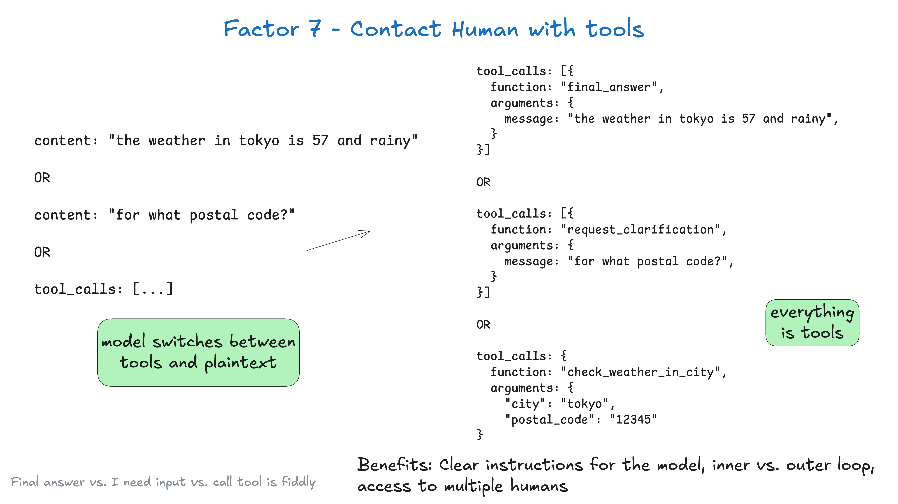
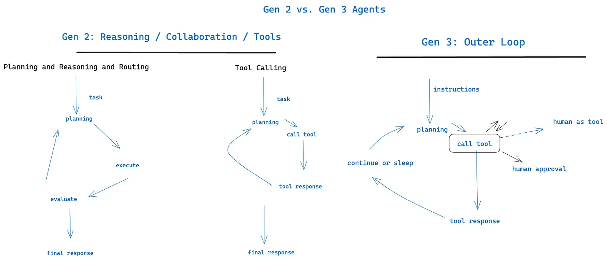

[← Back to README](../README.md)

### 7. Contact humans with tool calls

By default, LLM APIs rely on a fundamental HIGH-STAKES token choice: Are we returning plaintext content, or are we returning structured data?



You're putting a lot of weight on that choice of first token, which, in the `the weather in tokyo` case, is

> "the"

but in the `fetch_weather` case, it's some special token to denote the start of a JSON object.

> |JSON>

You might get better results by having the LLM *always* output json, and then declare it's intent with some natural language tokens like `request_human_input` or `done_for_now` (as opposed to a "proper" tool like `check_weather_in_city`). 

Again, you might not get any performance boost from this, but you should experiment, and ensure you're free to try weird stuff to get the best results.

```python

class Options:
  urgency: Literal["low", "medium", "high"]
  format: Literal["free_text", "yes_no", "multiple_choice"]
  choices: List[str]

# Tool definition for human interaction
class RequestHumanInput:
  intent: "request_human_input"
  question: str
  context: str
  options: Options

# Example usage in the agent loop
if nextStep.intent == 'request_human_input':
  thread.events.append({
    type: 'human_input_requested',
    data: nextStep
  })
  thread_id = await save_state(thread)
  await notify_human(nextStep, thread_id)
  return # Break loop and wait for response to come back with thread ID
else:
  # ... other cases
```

Later, you might receive a webhook from a system that handles slack, email, sms, or other events.

```python

@app.post('/webhook')
def webhook(req: Request):
  thread_id = req.body.threadId
  thread = await load_state(thread_id)
  thread.events.push({
    type: 'response_from_human',
    data: req.body
  })
  # ... simplified for brevity, you likely don't want to block the web worker here
  next_step = await determine_next_step(thread_to_prompt(thread))
  thread.events.append(next_step)
  result = await handle_next_step(thread, next_step)
  # todo - loop or break or whatever you want

  return {"status": "ok"}
```

The above includes patterns from [factor 5 - unify execution state and business state](./factor-5-unify-execution-state.md), [factor 8 - own your control flow](./factor-8-own-your-control-flow.md), [factor 3 - own your context window](./factor-3-own-your-context-window.md), and [factor 4 - tools are just structured outputs](./factor-4-tools-are-structured-outputs.md), and several others.

If we were using the XML-y formatted from [factor 3 - own your context window](./factor-3-own-your-context-window.md), our context window after a few turns might look like this:

```xml

(snipped for brevity)

<slack_message>
    From: @alex
    Channel: #deployments
    Text: Can you deploy backend v1.2.3 to production?
    Thread: []
</slack_message>

<request_human_input>
    intent: "request_human_input"
    question: "Would you like to proceed with deploying v1.2.3 to production?"
    context: "This is a production deployment that will affect live users."
    options: {
        urgency: "high"
        format: "yes_no"
    }
</request_human_input>

<human_response>
    response: "yes please proceed"
    approved: true
    timestamp: "2024-03-15T10:30:00Z"
    user: "alex@company.com"
</human_response>

<deploy_backend>
    intent: "deploy_backend"
    tag: "v1.2.3"
    environment: "production"
</deploy_backend>

<deploy_backend_result>
    status: "success"
    message: "Deployment v1.2.3 to production completed successfully."
    timestamp: "2024-03-15T10:30:00Z"
</deploy_backend_result>
```


Benefits:

1. **Clear Instructions**: Tools for different types of human contact allow for more specificity from the LLM
2. **Inner vs Outer Loop**: Enables agents workflows **outside** of the traditional chatGPT-style interface, where the control flow and context initialization may be `Agent->Human` rather than `Human->Agent` (think, agents kicked off by a cron or an event)
3. **Multiple Human Access**: Can easily track and coordinate input from different humans through structured events
4. **Multi-Agent**: Simple abstraction can be easily extended to support `Agent->Agent` requests and responses
5. **Durable**: Combined with [factor 6 - launch/pause/resume with simple APIs](./factor-6-launch-pause-resume.md), this makes for durable, reliable, and introspectable multiplayer workflows

[More on Outer Loop Agents over here](https://theouterloop.substack.com/p/openais-realtime-api-is-a-step-towards)



Works great with [factor 11 - trigger from anywhere, meet users where they are](./factor-11-trigger-from-anywhere.md)

[← Launch/Pause/Resume](https://github.com/humanlayer/12-factor-agents/blob/main/content/factor-6-launch-pause-resume.md) | [Own Your Control Flow →](https://github.com/humanlayer/12-factor-agents/blob/main/content/factor-8-own-your-control-flow.md)
